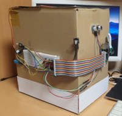
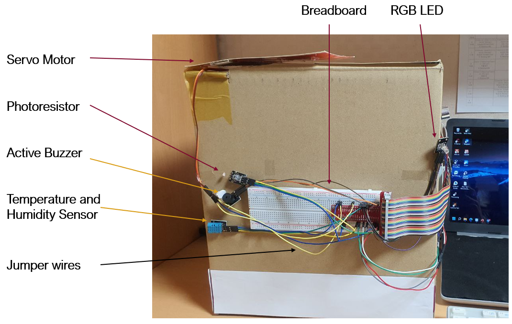
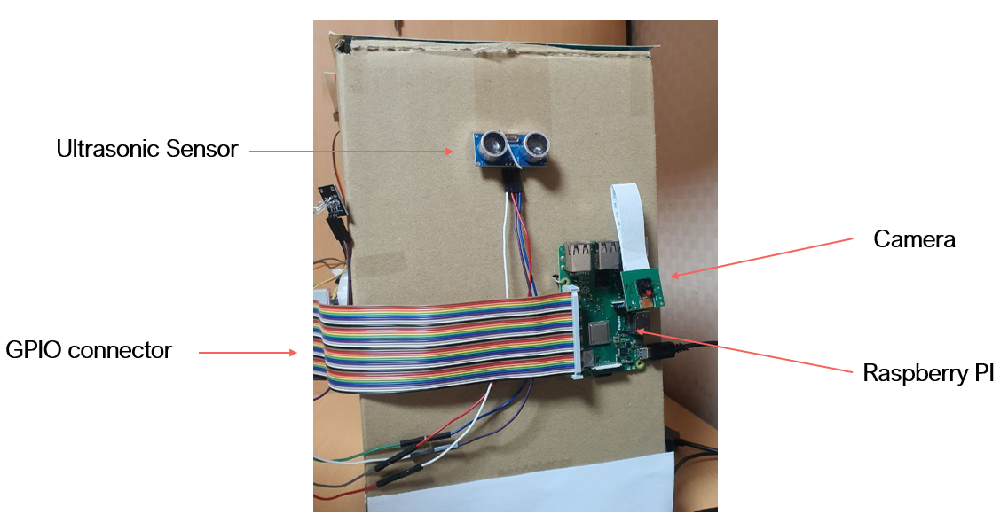

# Smart Dustbin (Raspberry Pi)

* The purpose of our project is to provide a supervision device for intelligent waste bin. This device integrates several sensors to manage the state of the trash. 
* Smart Dustbin is simply speaking a trash bin that automatically opens when you come close to throw trash.  
* It has a blind mode feature which makes a sound that helps blind people to locate the bin before throwing trash.  
* It can even be used as a secret surveillance tool using camera or room condition checker for temperature and light.   
* It’s so cool that you will not want to throw trash in it. 😆😎  

## Hardware and Sensors

<table>
	<tr>
		<td>Raspberry Pi 4</td>
		<td>Breadboard</td>
	</tr>
	<tr>
		<td>16 GB MicroSD Card</td>
		<td>GPIO connector</td>
	</tr>
	<tr>
		<td>Monitor</td>
		<td>microHDMI to HDMI Cable</td>
	</tr>
	<tr>
		<td>Keyboard and Mouse</td>
		<td>Ultrasonic sensor</td>
	</tr>
	<tr>
		<td>Camera</td>
		<td>Temperature and Humidity Sensor</td>
	</tr>
	<tr>
		<td>RGB LED</td>
		<td>Servo Motor</td>
	</tr>
	<tr>
		<td>Photoresistor</td>
		<td>Active Buzzer</td>
	</tr>
	<tr>
		<td>Mini Switch</td>
		<td>Jumper Wires</td>
	</tr>

</table>

## Software

<table>
	<tr>
		<td>Raspberry Pi Imager</td>
		<td>Python 3.10</td>
	</tr>
	<tr>
		<td>Thony IDE</td>
		<td>GPIO libraries</td>
	</tr>
	<tr>
		<td>PiCamera</td>
		<td>Adafruit_DHT</td>
	</tr>
	<tr>
		<td>Telegram Messenger</td>
		<td>Python Telegram Bot API (to remote control)</td>
	</tr>
</table>

## Sensors Placement
  

## Features & Testing
* Servo Motor automatically opens dustbin cover when Ultrasonic Sensor detects an object within 50cm.
* RGB alerts by turning Red, Green, Blue colors consecutively for a short moment.
* If blind mode is enabled, Active Buzzer makes a sound for blind person to locate the dustbin.
* Closes cover automatically after 3 seconds.

